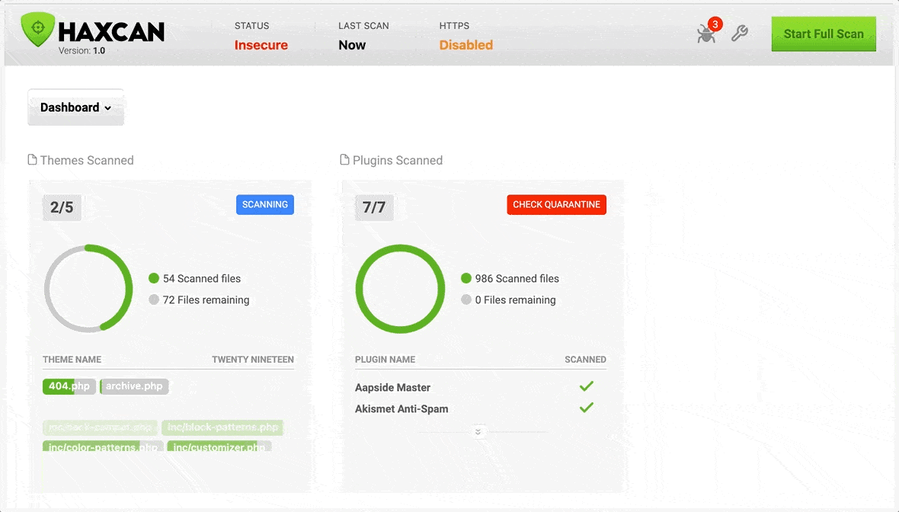

# Haxcan - WordPress Malware Scanner

Got pwnd? `haxcan` (hack scan) scans all the WordPress files for a potentional malware in just one click. No bloated and useless settings, just activate and scan!

Contents
========

 * [Why?](#why)
 * [Installation & Usage](#installation)

### Why?

While there are a few WordPress scanners already available, configuring them can be time consuming and can lead to false reports. This is where Haxcan thrives:

+ Ease of usage: install plugin > activate > click Scan
+ Ability to scan themes,plugins or both
+ Desktop antivirus user experience 
+ Scans for all risky functions: assert|file_get_contents|curl_exec|popen|proc_open|unserialize|eval|base64_encode|base64_decode|create_function|exec|shell_exec|system|passthru|ob_get_contents|file|curl_init|readfile|fopen|fsockopen|pfsockopen|fclose|fread|file_put_contents

And is incredibly fast!

### Installation & Usage
---

#### Step 1

Download plugin

#### Step 2

Upload to `wp-content/plugins/`, go to `Appearance->Plugins` and click `Activate`

#### Step 3

In Dashboard menu click `Haxcan` and start scanning :)

